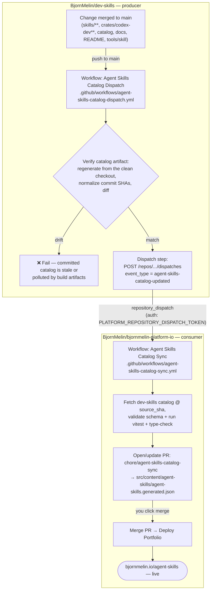

# Agent Skills Lab catalog pipeline (dev-skills → bjornmelin.io)

How a skill change in this repo reaches the public **Agent Skills Lab** at
[`bjornmelin.io/agent-skills`](https://bjornmelin.io/agent-skills). This is the
single source of truth for the end-to-end, cross-repo flow. The consumer half is
also documented, from the site's perspective, in
[`bjornmelin-platform-io › docs/deployment/ci-cd.md`](https://github.com/BjornMelin/bjornmelin-platform-io/blob/main/docs/deployment/ci-cd.md).

## The pipeline at a glance



Only **one** manual action is required in the happy path: merging the auto-opened
catalog-sync PR. Everything else is automatic.

## Stage 1 — Catalog generation (dev-skills)

The public artifact `catalog/agent-skills-lab.json`
(schema `agent_skills_lab_catalog.v1`) is produced by the `codex-dev` CLI:

```bash
cargo run -q -p codex-dev -- --json skills catalog \
  --source-ref main \
  --out catalog/agent-skills-lab.json
```

See [codex-dev CLI Reference › skills catalog](codex-dev-cli.md#skills-catalog)
for flags and the output shape.

> **Regenerate from a clean tree.** Resource counts (references/scripts/etc.)
> walk each skill's directories **on disk**, so a dirty working tree can skew
> them. Unambiguous build/dependency dirs are ignored automatically
> (`target/`, `node_modules/`, `.next/`, `.turbo/`, `.venv/`, `.cache/`,
> `.git/`, `__pycache__/`, `*.pyc`/`*.pyo`), but `.gitignore`d generated files and
> empty local directories can still differ from a fresh checkout. Before
> committing a regenerated catalog, run against a clean tree — `git stash` the
> worktree, or point `--repo-root` at a detached worktree
> (`git worktree add --detach /tmp/ds-clean HEAD`). CI regenerates from the
> pushed commit and diffs (Stage 2), so a locally polluted artifact fails.

## Stage 2 — Verify + dispatch (dev-skills)

`.github/workflows/agent-skills-catalog-dispatch.yml` runs on **push to `main`**
when any catalog-affecting path changes (the workflow file, `catalog/`,
`crates/codex-dev-core/**`, `crates/codex-dev/**`, `docs/**`, `README.md`,
`skills/**`, `tools/skill/**`) and via manual `workflow_dispatch`.

1. **Verify catalog artifact**: calls the same
   `tools/skill/check_catalog.sh` used by PR CI. It regenerates from the
   checked-out commit with `--source-commit ${GITHUB_SHA}` and
   `--source-ref main`, normalizes both the committed and freshly-generated
   copies (replacing the tracked SHA and the workflow SHA with
   `<sourceCommit>`, and reusing the committed `generatedAt`), then `diff`s them.
   A mismatch means the committed `catalog/agent-skills-lab.json` is stale or was
   generated from a polluted tree — the job **fails here** and nothing is
   dispatched. (See [Operations](#operations) to debug this.)
2. **Dispatch bjornmelin.io rebuild** — sends a `repository_dispatch` event to
   the platform repo:

   ```text
   POST /repos/BjornMelin/bjornmelin-platform-io/dispatches
   event_type = agent-skills-catalog-updated
   client_payload = { source_repository, source_ref, source_sha, catalog_path }
   ```

   `source_sha` is the 40-hex commit SHA, which the consumer requires for
   `repository_dispatch` (see Stage 3).

### The dispatch token

The dispatch step authenticates with the **`PLATFORM_REPOSITORY_DISPATCH_TOKEN`**
repository secret (a cross-repo token — the workflow's built-in `GITHUB_TOKEN`
cannot reach another repo).

- **What it is:** a fine-grained PAT scoped to **`bjornmelin-platform-io` only**
  with **Contents: Read and write** (the permission `POST …/dispatches`
  requires). Nothing else.
- **Set it:** `gh secret set PLATFORM_REPOSITORY_DISPATCH_TOKEN -R BjornMelin/dev-skills`
  (paste the token at the prompt so it never lands in shell history).
- **If it is absent** the dispatch step logs
  `Skipping dispatch because PLATFORM_REPOSITORY_DISPATCH_TOKEN is not configured.`
  and **exits 0** — the run is green but the platform is never notified.
  Re-running this workflow will keep skipping until the token is set; to sync
  in the meantime, drive the platform directly (the second command under
  [Force a resync](#force-a-resync), which needs no dispatch token).

## Stage 3 — Sync (platform)

The `repository_dispatch` event triggers
`.github/workflows/agent-skills-catalog-sync.yml` in
`bjornmelin-platform-io`. It resolves the source (`source_sha` overrides
`source_ref`; `repository_dispatch` **requires** a 40-hex `source_sha`), fetches
the dev-skills catalog at that ref with the platform's own token (dev-skills is
public), validates the schema and invariants (`skillsCount == skills.length`,
`totalSkillDirectories >= skillsCount`), runs
`pnpm vitest run …/agent-skills-data.test.ts` + `pnpm type-check`, writes
`src/content/agent-skills/agent-skills.generated.json`, and opens/updates the
PR `chore/agent-skills-catalog-sync`. The PR is idempotent — it no-ops when the
catalog is unchanged. Detail lives in
[the platform's ci-cd doc](https://github.com/BjornMelin/bjornmelin-platform-io/blob/main/docs/deployment/ci-cd.md).

## Stage 4 — Merge + deploy (platform)

Merging the catalog-sync PR to `main` runs the standard **Deploy Portfolio**
workflow (static export → S3 → CSP-hash KVS sync → CloudFront invalidation),
publishing the refreshed catalog to `bjornmelin.io/agent-skills`. The page reads
the committed `agent-skills.generated.json` via `src/data/agent-skills.ts`.

## Operations

### Force a resync

To backfill without a new dev-skills commit, trigger either end manually:

```bash
# Re-run verify + dispatch from dev-skills main. Fires repository_dispatch ONLY
# if PLATFORM_REPOSITORY_DISPATCH_TOKEN is configured — otherwise it just skips
# (green but no-op), so this is not the fix for the missing-token case:
gh workflow run agent-skills-catalog-dispatch.yml -R BjornMelin/dev-skills

# Drive the platform directly. Needs NO dispatch token (the sync uses the
# platform's own token to read the public catalog), so this is the correct
# path when the token is missing:
gh workflow run agent-skills-catalog-sync.yml -R BjornMelin/bjornmelin-platform-io \
  -f source_sha="$(git -C /path/to/dev-skills rev-parse origin/main)"
```

### Debug a failed "Verify catalog artifact"

A `diff` failure means the committed catalog ≠ a clean regeneration. The usual
cause is **build-artifact pollution** at generation time (a stray `target/` or
`node_modules/` under a skill inflated its resource counts). Fix by regenerating
from a clean tree (Stage 1) and committing the result:

```bash
git worktree add -q --detach /tmp/ds-clean HEAD
cargo run -q -p codex-dev -- --json skills catalog \
  --repo-root /tmp/ds-clean --source-commit "$(git rev-parse HEAD)" \
  --out catalog/agent-skills-lab.json
git worktree remove --force /tmp/ds-clean
```

CI normalizes commit SHAs and `generatedAt`, so those never cause a diff — only
real content (resource counts, skill set, ordering) does.

### Rotate the dispatch token

Regenerate the fine-grained PAT (Settings → Developer settings → Fine-grained
tokens → the `dev-skills → platform catalog dispatch` token → Regenerate), then
re-set the secret with `gh secret set PLATFORM_REPOSITORY_DISPATCH_TOKEN -R BjornMelin/dev-skills`.
No workflow change is needed. Verify with a manual dispatch and confirm a
`repository_dispatch` run appears on the platform:

```bash
gh workflow run agent-skills-catalog-dispatch.yml -R BjornMelin/dev-skills
gh run list -R BjornMelin/bjornmelin-platform-io \
  --workflow=agent-skills-catalog-sync.yml --limit 1 \
  --json event,status,conclusion   # expect event=repository_dispatch
```

## Related

- [codex-dev CLI Reference](codex-dev-cli.md) — the `skills catalog` command.
- [Validation runbook](../runbooks/validation.md) — catalog checks in context.
- `.github/workflows/agent-skills-catalog-dispatch.yml` — the producer workflow.
- Platform: `.github/workflows/agent-skills-catalog-sync.yml`,
  `docs/deployment/ci-cd.md`, `src/data/agent-skills.ts`.
